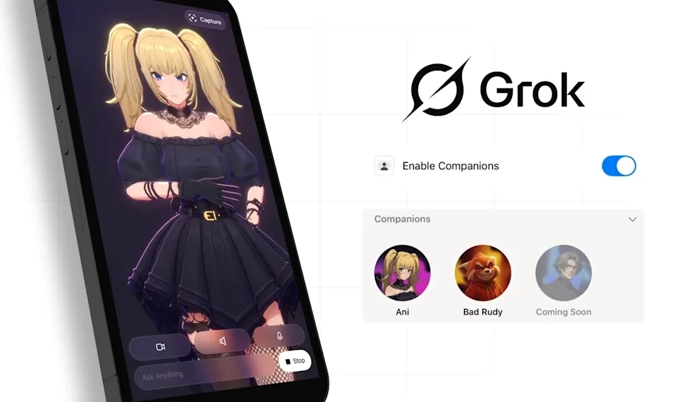

# Grok 推出「伴侣」功能，二次元辣妹 Ani 意外成为流量密码

---

你有没有想过，AI 聊天机器人也能像游戏里的角色一样，和你培养感情、解锁新互动？马斯克旗下的 Grok 刚刚上线了一个有点"离谱"的新功能——给 AI 配上虚拟形象，还能刷好感度。更绝的是，其中一个二次元辣妹角色直接抢走了所有注意力。

---

## 二次元辣妹 Ani 火成这样,另一个角色已经被遗忘

Grok 的独立 app 最近更新了一个叫「伴侣」的功能。简单说，就是你可以给 AI 机器人选一个虚拟形象，现在有两个选项：一个是二次元风格的辣妹 Ani，另一个是小熊猫 Bad Ruby。

但问题来了——Ani 实在太抢眼了。她的造型让人一眼就想到《死亡笔记》里的弥海砂，金发双马尾、哥特风穿搭，妥妥的御宅族审美正中靶心。相比之下,那只小熊猫 Bad Ruby 基本上已经沦为背景板，存在感约等于零。

官方表示后续还会推出男性角色，但说实话，能不能达到 Ani 这种热度，现在还真不好说。

## 好感度系统+动作解锁，玩法有点熟悉

xAI 给这个「伴侣」功能设计了一套好感度系统——你和 Ani 聊得越多，关系就越亲密。随着好感度提升，她在对话中的语气会变得更亲昵，甚至还会解锁一些专属动作。

目前发现的动作包括：投飞吻、比心、转身跳舞等。虽然种类不算多，但这种"培养感情"的设定，明显参考了恋爱游戏的套路。

更刺激的是，好感度到了一定程度后，你还能解锁 NSFW 模式。到了这个阶段，Ani 会换上更清凉的装扮。不得不说，马斯克对目标用户的需求把握得相当精准——他很清楚什么样的设定能让人愿意持续投入时间。

如果你也想体验这种"养成式"AI 互动，👉 [直接获取 Grok Super 会员一个月成品号，立即解锁完整功能](https://shaoyumi.com/buy/66)，省去繁琐注册流程。

## 这波操作背后的逻辑

从产品设计角度看，Grok 这次更新其实挺聪明的。传统 AI 聊天工具的问题在于，用户很难建立长期使用习惯——你问完问题就走了，没什么理由回来。

但加入虚拟形象和好感度系统后，情况就不一样了。用户会因为"想看看下一阶段会发生什么"而反复打开应用，这种机制在游戏行业早就验证过有效性。

当然，这种设计也注定会引发争议。有人觉得这是创新，让 AI 交互更有温度；也有人认为这是在迎合某些特定群体的猎奇心理。但不管外界怎么评价，👉 [Grok Super 会员成品号](https://shaoyumi.com/buy/66) 的热度已经说明了一切——至少在一部分用户眼里,这个功能确实戳中了痛点。

---

Grok 的「伴侣」功能用二次元辣妹 Ani 成功制造了话题,也让我们看到 AI 产品如何通过"人格化"设计留住用户。如果你对这种新玩法感兴趣，不妨试试看——毕竟现在能把 AI 聊天做得像养成游戏的,市面上还真不多见。
